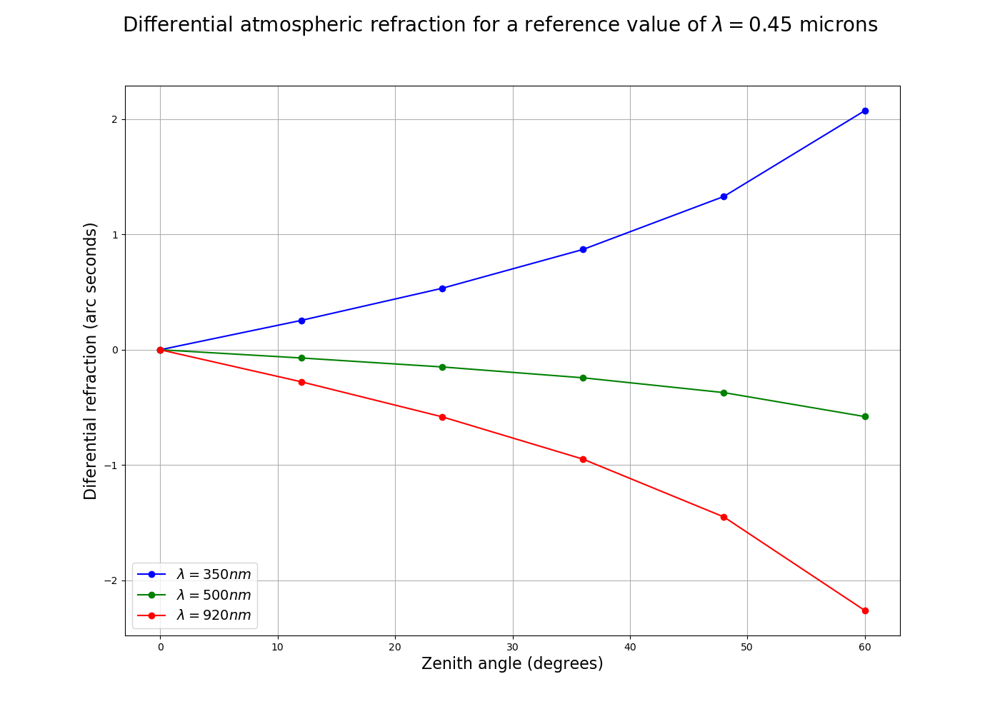
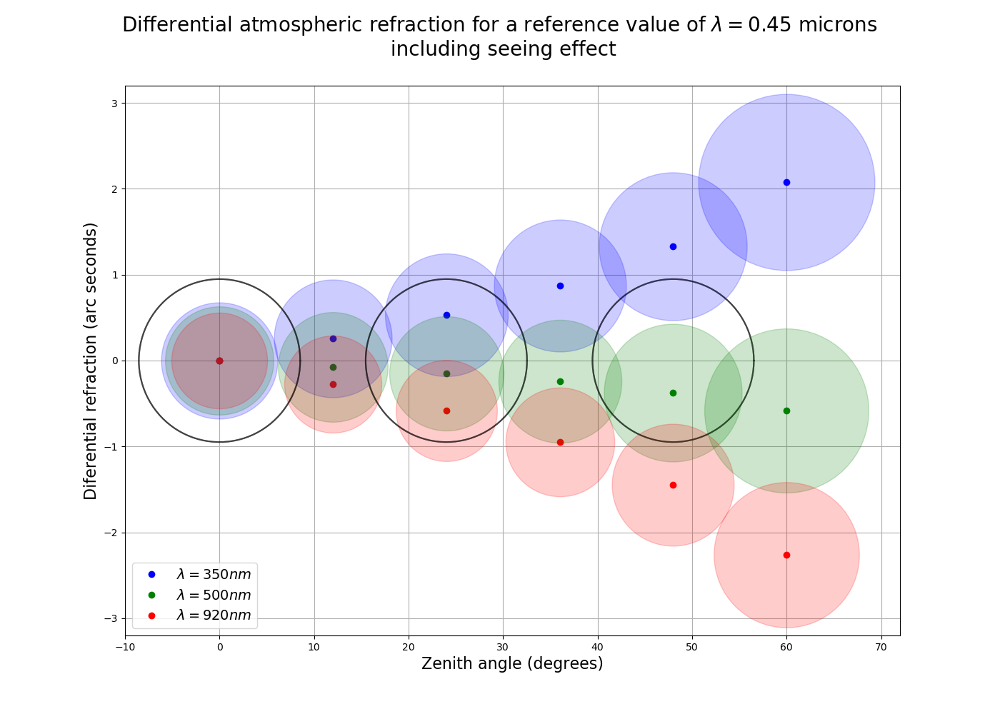

# IA_practica1
The objective of this practice is to model the image on the focal plane of a telescope of a star observed at a certain zenith distance. In this way, the importance of atmospheric scattering in astronomical observations in the range visible from Earth will be understood.

